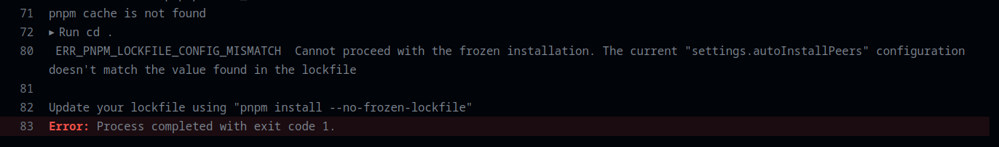
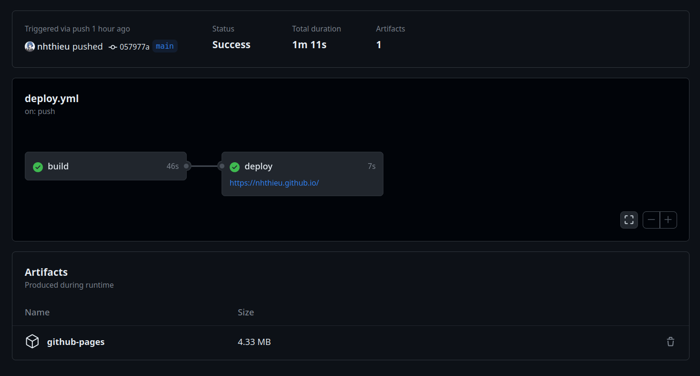

I deployed my website with Vercel before because it was easy and the free tier is generous enough. But on a beautiful day when I accidentally messed up the 1000 image optimization limit while building a gallery website, I thought to myself: "Well, sh*t". I don't want to make that same mistake again, now that I have used up 80% of the limit, and I want to reserve the remaining space for future projects. So I decided to move to Github Pages (which is what I should have gone with in the first place).

## Github Pages

It's free. I mean, the limits are enough for free usage and I don't think a simple website like this will ever exceed them. You can view more details [here](https://docs.github.com/en/pages/getting-started-with-github-pages/about-github-pages#limits-on-use-of-github-pages).

The problem with Github Pages is that it requires an `index.html` file. But my website is built with Astro, which doesn't have an `index.html` file unless I build it. This is where `Github Actions` comes to the rescue.

## Github Actions

Github Actions is a CI/CD tool that allows you to automate your workflow. It's free for public repositories. You can view more details [here](https://docs.github.com/en/actions/learn-github-actions/introduction-to-github-actions).

Astro has a [documentation](https://docs.astro.build/en/guides/deploy/github/) on how to do deploy with Github Actions. It uses `withastro` action behind the scene to build the website. But there's a little bug with the `pnpm` that I use for the package manager that breaks the build.



Why `pnpm` you may ask? Well, `npm` is slow, though the `withastro` works fine with `npm` (I built with it when I found out that `pnpm` failed), but I want the speed of `pnpm`, not just for the build process but also for the development process.

After a bit of research, I found out that the bug is caused by the `pnpm` version that I use that conflicts with the `withastro` action. So I decided to write the build script myself. In order to understand the process that the `withastro` action abstracts away, I had to read the [source code](https://github.com/withastro/action/blob/main/action.yml) and was suprised to find out that it wasn't complicated after all. In a nutshell, it does the following:

1. Check the package manager based on the `package-lock.json` file
2. Setup pnpm
3. Setup Node
4. Install dependencies
5. Build
6. Upload artifacts

Well, I just followed the steps and just changed the version to a newer one, of course with the help from the [pnpm documentation](https://pnpm.io/continuous-integration#github-actions):

```yaml
# other stuff up here...
jobs:
  build:
    runs-on: ubuntu-latest
    steps:
    # I need to checkout the repository first
    - name: Checkout your repository using git
      uses: actions/checkout@v3
    # Setup the package manager. Since I use pnpm so I hardcode it anyway
    - name: Setup pnpm
      uses: pnpm/action-setup@v2
      with:
        version: 8
    # Setup Node, with caching package dependencies
    - name: Use Node.js
      uses: actions/setup-node@v3
      with:
        node-version: 18
        cache: 'pnpm'
    # Install dependencies
    - name: Install dependencies
      run: pnpm install
    # Build the website
    - name: Build
      run: pnpm run build
    # Upload the artifacts
    - name: Deploy to GitHub Pages
      uses: actions/upload-pages-artifact@v2
      with:
        # The directory that the website is built to (dist in my case)
        path: dist 
```

The rest of the script is just the same as the one in the Astro documentation, with a minor change to the `deploy` job:

``` yaml
jobs:
  # other stuff up here...
  deploy:
    needs: build
    runs-on: ubuntu-latest
    environment:
      name: github-pages
      url: ${{ steps.deployment.outputs.page_url }}
    steps:
      - name: Deploy to GitHub Pages
        id: deployment
        uses: actions/deploy-pages@v2 # change the version to v2
```

The remaining steps are fairly simple:

1. Rename the repo to `<username>.github.io`
2. Modify `astro.config.mjs`:

```js
export default defineConfig({
  site: 'https://<username>.github.io',
  // other stuff down here...
})
```

3. On GitHub, go to your repository’s Settings tab and find the Pages section of the settings.
4. Choose GitHub Actions as the Source of your site.

And that's it. Now whenever I commit and push something new to the repo, Github Actions will automatically build and deploy the website for me. Nonetheless, I still hope that the `withastro` action will be fixed soon so that I can use it again.



The whole website is not even 5mb, not bad huh? You can view the the whole script on my [Github repo](https://github.com/nhthieu/nhthieu.github.io/blob/main/.github/workflows/deploy.yml)

## References

- [Astro documentation](https://docs.astro.build/en/guides/deploy/github/)
- [pnpm documentation](https://pnpm.io/continuous-integration#github-actions)
- [Github Actions documentation](https://docs.github.com/en/actions/learn-github-actions/introduction-to-github-actions)
- [withastro action](https://github.com/withastro/action/blob/main/action.yml)
