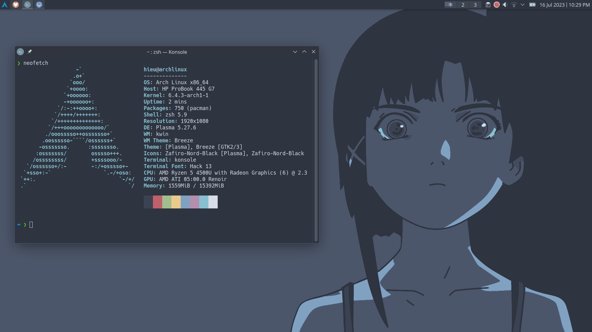

I love Ubuntu, and had been using it for a long time since I started my Linux journey. I love the stability, the ease of use, the package manager, and the community. However, ever since Canonical's decision to move commonly used applications, like the web browsers, exclusively to Snap packages and the additional overhead that came with those being containerized instead of just running on the bare metal was ultimately my reason for ditching Ubuntu. It just leaves a bad impression on me.

I then began distro-hopping to find an alternative, and it sort of became a hobby of mine to try out different distros. I tried Mint, hopped to Debian for a while for my projects, stayed on Fedora for its Flatpak support and "cutting edge" packages for the last couple of months. Though, due to the recent Red Hat [drama](https://www.youtube.com/watch?v=kF5pyVUQBH8&t=279s) that's been going on in the Linux community, I started to have second thoughts. Don't get me wrong, I'm not a Linux elitist to be giving out these opinions, I just want to use a distro that I can trust and not have to worry about all the fuss behind it.

## I use Arch btw

I knew of Arch probably because of the [memes](https://www.youtube.com/watch?v=Drd5qA4bsaM), and to be honest, I think my decision of using Arch was because of them. I admit at first I was hesitant to try it out on my machine because of the difficulty and the breakages that people have been passing around, but daily driving it for the last month has legitimately been far better than any experiences I’ve had with other distros before. It's fast, smooth, and it makes me feel like a real Linux elitist (I'm not, I swear).

## Minimal Installation

Let's be honest, have you ever looked at the System Monitor and wondered why your Windows CPU usage was so high? Or, when you opened the Applications and saw all these pre-installed apps/packages that you don't even use? I have, and it's annoying. They take up space, and they're just there, doing nothing. Arch is a minimal distro, which means it's up to the user to decide what packages to install. Hell, even the installation process is minimal. It's just a simple TTY and that's it.

Luckily, it comes with the `archinstall` script which makes the installation process so much easier, and it's pretty straightforward to follow. It does the heavy lifting for you, like the bootloader, networking, audio and video drivers. Still, it's required to manually partition the drives, and install the essential packages for later usage, which I wouldn't have learned if I just used the GUI installer.

Right off the installation, what you get is a barebones system with just the essential packages installed, a lot more barebones than I was used to with Ubuntu or Debian. Everything after that point is the second and onward parts bags, all of the additional media codecs, supporting applications, and things that most distributions such as Ubuntu or Fedora have off the rip, you have to add on yourself. I prefer it this way since I can choose what packages to install, no bloatwares whatsoever, just a clean system with minimal overhead and without unnecessary additions or modifications. 

## The Arch Wiki

It's no secret that the [Arch Wiki](https://wiki.archlinux.org/) is one of the best resources for Linux users. It's a great source of information, even for non Arch users. It's well written, easy to follow, and it's always up to date. Most of the problems I have throughout my daily usage of Arch were solved by the wiki, like networking issues, simple things like changing the system font or even the problems I had using other distros can be found on the wiki. It's so great that I learned more about Linux on the Arch Wiki than I did on any other sites out there.

## Bleeding-edge Packages and AUR

Arch is a rolling release distro, which means that you get the latest packages as soon as they're released. This is great for me since I don't have to wait for the next release to get the latest packages, and usually they fix the bugs on the previous versions pretty fast. People say that this can lead to breakage, but to be honest, as long as you backup your system and read the update notes before updating (which you should do on any distro), you should be fine. Plus, pacman is awesome.

Another best things about Arch is the AUR (Arch User Repository). It's a community-driven repository for Arch users to share and install packages. Think of it as the Play Store on Android, but for Linux. When I can't find a certain package on the official repository, it most likely exists on the AUR. However, this is a double-edged sword since the packages on the AUR are not officially supported by Arch, and it's up to the user to maintain them. This means that the packages on the AUR can be outdated, or even broken. But as long as the maintainer is active and the upstream is a reliable source, you should be fine.

## Conclusion

At the end of the day, Arch or any distro is just a tool, and as long as you feel comfortable, have fun, and it helps you with your work, then it's the best distro. I like Arch because it is what I want it to be. It's minimal, fast and reliable. Being able to dig in the system configurations and customize it to my liking helps me learn more about Linux, and I think that's the beauty of Arch. It also helps me build this mindset of figuring things out on my own, learning to be comfortable with being uncomfortable fixing and exploring things that I don't know, and to be honest, isn't that what programming is all about? - the fact that you learn something new everyday, and you learn as you go.

The chance of breakage is non-zero but the seas have been smooth sailing, and I'm enjoying the ride. 

Oh, I use Arch btw.
