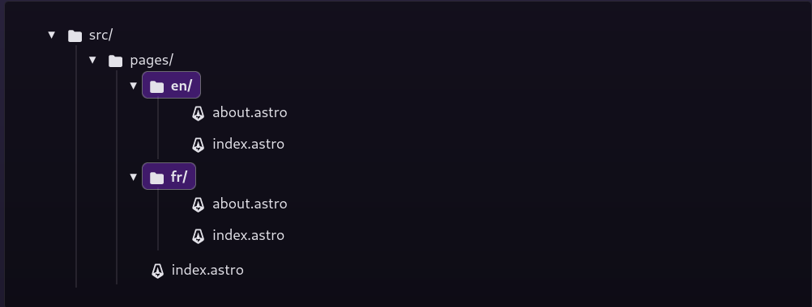

**i18n**: Internationalization - the process of designing a software application so that it can be adapted to various languages and regions without engineering changes.

## The situation

As I have mentioned in my [The Website Architecture](/blog/tech-stack) post (which I will update soon) that I wanted to add multiple languages support to my website so that I can have my articles in both English and Vietnamese (probably will add French in the future). However, Astro doesn't come built-in with i18n support, which is a bummer. Luckily, since I guess it's a common problem, they dedicated a section in their [documentation](https://docs.astro.build/en/recipes/i18n/) for it. This article will be an adaptation of that section and how i customized it to fit my needs.

**Note**: I find translating my contents to Vietnamese is a bit of a hassle since I'm so used to writing and documenting everything in English, plus it's a bit cringe to read my own writing in Vietnamese. For that reason, I only temporarily added i18n support to my website on a separate branch. I will merge it to the main branch once I have enough time to translate my articles and make sure everything works as intended.

## The setup

### The folder structure

Astro's documentation suggests:

*Create a directory for each language you want to support. For example, en/ and fr/ if you are supporting English and French.*



This means that the url will look something like `/en/about` for English and `/fr/about` for French. This works but there's a problem with this approach: **it's not scalable**. What if I want to add another language, say Vietnamese? I will have to create another folder `vn` and copy all the files to that new folder. This is not ideal since there will be a lot of repetitive code and the codebase will get messy.

There's a better way to do this: **utilizing Astro's [dynamic routes](https://docs.astro.build/en/core-concepts/routing/)**. Instead of creating a folder for each language, I created a single folder `[lang]` that will contain all the translated files, put it in the `src/pages` directory and add all the files to it. It would look like this:


This way, I can add as many languages as I want without having to create a new folder for each language. The url will look like this: `/en/about` for English, `/vn/about` for Vietnamese, etc.

For the outtermost `index.astro` file, this will be the landing page of the website so I need to redirect the user to my desired language, in this case `en`

```astro
---
---
<meta http-equiv="refresh" content="0;url=/en/" />
```

### Generate all the possible paths

Since I'm using dynamic routes, I need to use `getStaticPaths()` to generate all the possible paths for the pages. And because every file is in the `src/pages/[lang]` folder, I need to generate the paths for each page, which means I need to create a `getStaticPaths()` function for each page. I know this is not ideal but for now it works, and I will try to find a better solution in the future.

In the `src/pages/[lang]/index.astro` file:

```astro
---
export function getStaticPaths() {
  return [{ params: { lang: "en" } }, { params: { lang: "vn" } }];
}
---
//...
```

In the `src/pages/[lang]/index.astro` file:
```astro
---
export function getStaticPaths() {
  return [{ params: { lang: "en" } }, { params: { lang: "vn" } }];
}
---
//...
```

and so on...

You can read more about `getStaticPaths()` and generating dynamic routes for Static (SSG) mode [here](https://docs.astro.build/en/core-concepts/routing/#static-ssg-mode)

### Translate the UI string

I'm just gonna follow Astro's documentation for this since they already did a great job explaining it. I will just add some comments to make it easier to understand.

1. Create a `src/i18n/ui.ts` file to store the translation strings:

```ts
export const languages = {
  en: 'English',
  vb: 'Tiếng Việt',
};

export const defaultLang = 'en';
export const ui = {
  en: {
    'nav.home': 'Home',
    'nav.about': 'About',
    'nav.projects': 'Projects',
    // ...
  },
  vn: {
    'nav.home': 'Trang chủ',
    'nav.about': 'Về mình',
    'nav.projects': 'Dự án',
    // ...
  },
} as const;

```

So essentially, I have a `languages` object that contains all the languages I want to support and a `ui` object that contains all the translated strings.

2. Create two helper functions: one to detect the page language based on the current URL, and one to get translations strings for different parts of the UI in `src/i18n/utils.ts`:

```ts
import { ui, defaultLang } from './ui';

export function getLangFromUrl(url: URL) {
  const [, lang] = url.pathname.split('/');
  if (lang in ui) return lang as keyof typeof ui;
  return defaultLang;
}

export function useTranslations(lang: keyof typeof ui) {
  return function t(key: keyof typeof ui[typeof defaultLang]) {
    return ui[lang][key] || ui[defaultLang][key];
  }
}
```

3. Import the helpers where needed and use them to choose the UI string that corresponds to the current language. For example, a `Header` component might look like:

```astro
---
import ThemeToggle from "./ThemeToggle";
import { getLangFromUrl, useTranslations } from '../i18n/utils';

const lang = getLangFromUrl(Astro.url);
const t = useTranslations(lang);
---
<header class="flex items-center justify-between pt-8 h-16 mb-16 w-full">
  <!-- <a href="/" class="text-4xl font-bold mb-4">Hieu's Website</a> -->
  <div class="flex space-x-4 md:space-x-3">
    <a class="hover:underline hover:text-dark/75 dark:hover:text-light/75" href={`/${lang}/`}>{t('nav.home')}</a>
    <a class="hover:underline hover:text-dark/75 dark:hover:text-light/75" href={`/${lang}/projects`}>{t('nav.projects')}</a>
    <a class="hover:underline hover:text-dark/75 dark:hover:text-light/75" href={`/${lang}/blog`}>Blog</a>
    <a class="hover:underline hover:text-dark/75 dark:hover:text-light/75" href={`/${lang}/about`}>{t('nav.about')}</a>
  </div>
  <div class="flex items-center space-x-4 md:space-x-2">
    <ThemeToggle client:only/>
  </div>
</header>
```

4. Each page must have a lang attribute on the `<html>` element that matches the language on the page. In this example, a reusable layout extracts the language from the current route:

```astro
---
import { getLangFromUrl } from '../i18n/utils';
const lang = getLangFromUrl(Astro.url);
const { title }: Props = Astro.props;
---
<html lang={lang}>
  <head>
    <meta charset="utf-8" />
    <link rel="icon" type="image/svg+xml" href="/favicon.svg" />
    <meta name="viewport" content="width=device-width" />
    <meta name="generator" content={Astro.generator} />
    <meta
      name="description"
      content="Hieu Nguyen's personal website. A place where I showcase my profile and write blogs"
    />
    <title>{title}</title>
  </head>
  <body
    class="bg-light dark:bg-dark text-dark dark:text-light max-w-2xl mx-auto px-8 text-base md:text-sm sm:px-6"
  >
    <Header />
    <slot />
    <Footer />
  </body>
</html>
```

### Language switcher

Again, I'm just gonna follow Astro's documentation for this since they already did a great job explaining it.

1. Create a component `LanguagePicker.astro` to show a link for each language, :

```astro
---
import { languages } from '../i18n/ui';
---
<ul>
  {Object.entries(languages).map(([lang, label]) => (
    <li>
      <a href={`/${lang}/`}>{label}</a>
    </li>
  ))}
</ul>
```

This is a very basic component that just renders a list of links for each language. The styling is up to you.

2. Add `<LanguagePicker />` to your site so it is shown on every page. For example, I added it to the `Header` component:

```astro
---
import ThemeToggle from "./ThemeToggle";
import LanguagePicker from "./LanguagePicker.astro";
import { getLangFromUrl, useTranslations } from '../i18n/utils';

const lang = getLangFromUrl(Astro.url);
const t = useTranslations(lang);
---
<header class="flex items-center justify-between pt-8 h-16 mb-16 w-full">
  <!-- <a href="/" class="text-4xl font-bold mb-4">Hieu's Website</a> -->
  <div class="flex space-x-4 md:space-x-3">
    <a class="hover:underline hover:text-dark/75 dark:hover:text-light/75" href={`/${lang}/`}>{t('nav.home')}</a>
    <a class="hover:underline hover:text-dark/75 dark:hover:text-light/75" href={`/${lang}/projects`}>{t('nav.projects')}</a>
    <a class="hover:underline hover:text-dark/75 dark:hover:text-light/75" href={`/${lang}/blog`}>Blog</a>
    <a class="hover:underline hover:text-dark/75 dark:hover:text-light/75" href={`/${lang}/about`}>{t('nav.about')}</a>
  </div>
  <div class="flex items-center space-x-4 md:space-x-2">
    <ThemeToggle client:only/>
    <LanguagePicker/>
  </div>
</header>
```

### Use collections for translated content

Since most of the content on my website is written in Markdown and I'm using Astro's Content Collections to manage them, I also need to translate them. Since the `content` folder is not a page, I can't actually use the dynamic route generation for it. Instead, I have to manually create as many folders as the number of languages I want to support and put the translated content in them.

1. Create a folder in src/content/ for each type of content you want to include and add subdirectories for each supported language. For example, to support English and Vietnamese blog posts:


2. Use dynamic route to fetch and render the content based on a `lang` and a `slug` parameter. In `src/pages/[lang]/blog/[slug].astro`:

```astro
---
import { getCollection } from "astro:content";

export async function getStaticPaths() {
  const pages = await getCollection("blog");
  const paths = pages.map((entry) => {
    const [lang, ...slug] = entry.slug.split("/");
    return {
      params: {
        lang,
        slug: slug.join("/"),
      },
      props: entry,
    };
  });

  return paths;
}

const entry  = Astro.props;
const { Content, headings } = await entry.render();
---
```

3. Generate the list of posts for each language. In `src/pages/[lang]/blog/index.astro`:

```astro
---
import { getCollection } from "astro:content";

const posts = await getCollection("blog", (blog) => {
  return blog.slug.split("/")[0] === lang && blog.data.draft !== true;
});

export function getStaticPaths() {
  return [{ params: { lang: "en" } }, { params: { lang: "vn" } }];
}
---
<div>
  {
    posts
      .sort((a, b) => (a.data.publishDate < b.data.publishDate ? 1 : -1))
      .map((post) => <BlogItem post={post} />)
  }
</div>
```

In the `BlogItem` component:

```astro
---
import { getLangFromUrl, useTranslations } from '@/i18n/utils';

const lang = getLangFromUrl(Astro.url);
const t = useTranslations(lang);
---
<a
  href=`/${lang}/blog/${post.slug.split('/')[1]}`
  class="hover:opacity-75 leading-relaxed"
>
</a>
//...
```

## Conclusion

Well that's pretty much it. I know there are a lot of things that I didn't cover in this article and some of the things I did might not be the best practice. But I hope this article can help you get started with adding i18n support to your Astro website.

You can check out the branch on [Github](https://github.com/nhthieu/my-portfolio/tree/feature/i18n).

## References

* [Astro's i18n documentation](https://docs.astro.build/en/recipes/i18n/)
* [Astro's dynamic routes documentation](https://docs.astro.build/en/core-concepts/routing/)
