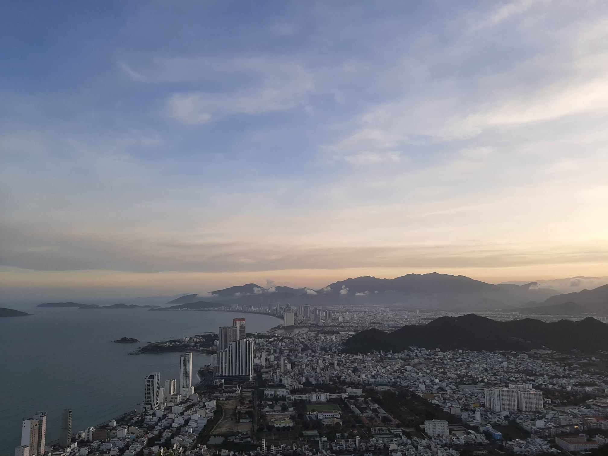
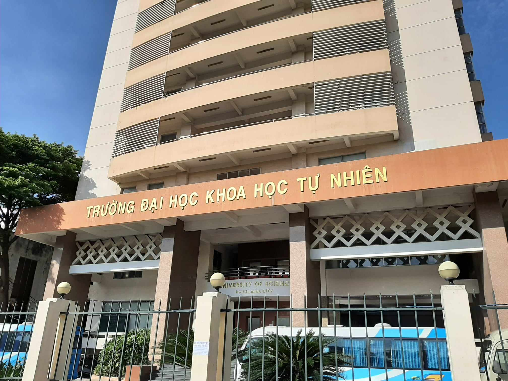

My full name is **Hieu Nguyen Ho Trung**, but feel free to call me **Hieu**, or **Hiu** (like my friends do), or **Tom** (got the name from [this movie](https://en.wikipedia.org/wiki/500_Days_of_Summer)) . I'm a dedicated college student, driven by my passion for programming, technology and a deep curiosity about the ever-evolving world of science. My interests span a broad spectrum of subjects, encompassing everything from technology, programming, science, music, and more.

There's a quote that I really like:

> The more I learn, the more I realize how much I don't know.
>
> - Albert Einstein

I'm *that guy* who is always eager to explore new things and always tinkering with ideas and making stuff. I'm a firm believer that anyone can have a solid grasp on anything if they put their mind to it, and I'm always looking for opportunities to learn new things and improve myself.

## Early Years

Born and raised in the beautiful coastal city of [Nha Trang, Vietnam](https://en.wikipedia.org/wiki/Nha_Trang), I was always fascinated by the world of technology. I was introduced to computers at a very young age and I was hooked. I spent most of my childhood tinkering with computers, learning how they work and how to use them. The moment I learned how to print *"Hello World"* on the screen, I knew I held the power to create anything I want, and was hooked on programming ever since.

## Education

I'm currently pursuing my dual Bachelor's degree in Information Technology at [Ho Chi Minh University of Science, Vietnam](https://hcmus.edu.vn/) (HCMUS). I enrolled in the [Vietnam-France](https://www.ctda.hcmus.edu.vn/vi/educational-program/chuong-trinh-viet-phap/) program, which is a joint program between HCMUS and [Claude Bernard University Lyon 1, France](https://www.univ-lyon1.fr/), mainly because I love the French language (although I'm not very good at it). I'm currently in my 3rd year of study and I'm expected to graduate in 2024.

<!--  -->

I can't say that I'm an excellent student but defnitely a dedicated one. I do enjoy learning new things and got the opportunities to meet and work with many talented people. I also got to participate in many interesting projects, events and competitions, which I'm very grateful for.

## Contact with me

I don't actively use social media, but I'm most responsive via [email](mailto:nguyenhotrunghieu0106@gmail.com). I also have a [Github account](https://github.com/nhthieu) and a [LinkedIn profile](https://www.linkedin.com/in/nhthieu16/).

## FAQ

### MBTI type?

I don't actually believe in MBTI or any other personality tests, but sure, I'm an INFJ. I'm also a Gemini, if you're into astrology (I'm not).

### Favorite music genre?

Rock and math rock, especially Japanese math rock. I also listen to jazz and classical music sometimes.

### Favorite movie?

*The Secret Life of Walter Mitty* (2013) and *The Shawshank Redemption* (1994).

### Favorite quote?

> However difficult life may seem, there is always something you can do and succeed at. It matters that you don't just give up.
>
> - Stephen Hawking

### Favorite programming language?

Definitely not Java.

### Favorite tech gadgets?

A good mechanical keyboard + a good pair of headphones = a happy me.

### What are you learning at the moment?

I'm currently learning about backend development, database modeling and design, and [Rust](https://www.rust-lang.org/) in my free time. I'm also learning French for my upcoming DELF B2 exam in November.
