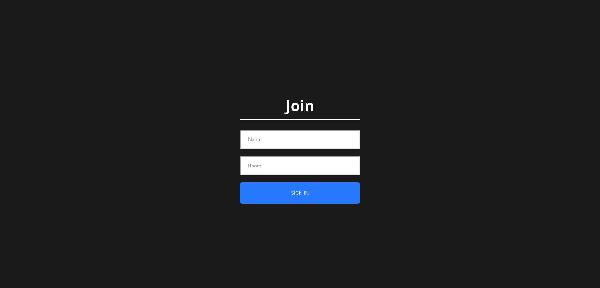

This project is a part of my learning process of React, NodeJS and Socket.io. It is not meant to be a full-fledged chat app, but rather a simple one to help me understand the basics of these technologies.

## Tech Stack

- **Programming Language:** JavaScript.
- **Front-end Framework:** React.
- **Back-end Framework:** NodeJS + Express.
- **Other Libraries:** Socket.io.

## Note

The site is temporarily down due to the server's end of service hosted on Heroku. Changes are to be made in the future!
