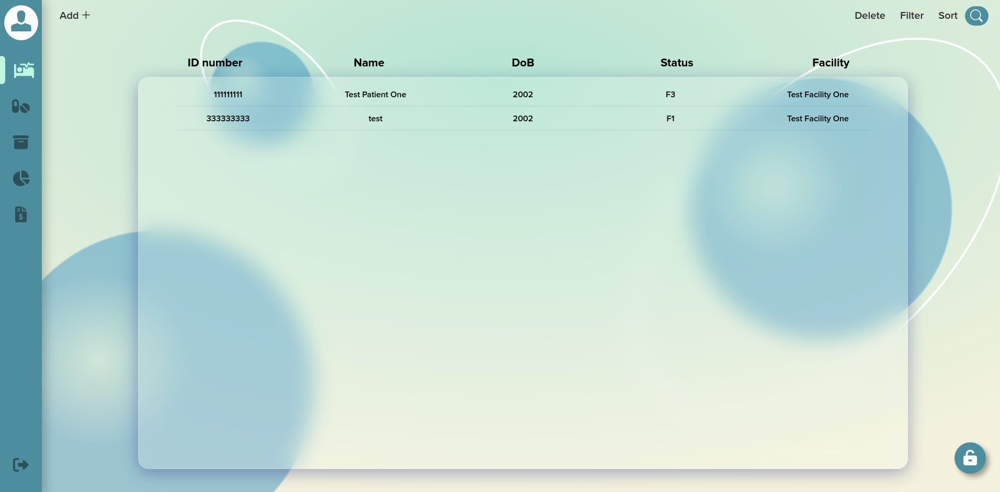

A COVID-19 Web App final project for the Web Development class at HCMUS. The website helps healthcare providers manage their patients and their products.



## Note

- The backend is hosted on Heroku, which has terminated the free dyno service. However, the backend is still functional and can be used as development environment.
- MongoDB Atlas instance has been stopped due to prolonged inactivity.

Sorry :<

## Introduction

The website comes with 3 account tiers:

- Admin (tier 1)
- Doctor (tier 2 manager)
- Patient (tier 3 user)

For the detailed functionalities, please refer to the [requirements.pdf](https://github.com/namhoai1109/Covid-web/blob/main/requirements.pdf) file for more informations (the file is in Vietnamese, no English version for the moment).

Technologies used:

- Front-end: React.js
- Back-end: Node.js, Express.js, MongoDB

## Prerequisites

1. Install npm and Node.js
2. Allow invalid certificate in the browser (go to flags in the address bar and search for "Allow invalid certificates" and click "Enabled" )

## Run

The project comes with a pre-built script file to run all the necessary services.

- For Linux, locate to the project folder and run the following command (make sure to enable execution permission):
  ```
  sudo chmod +x run.sh
  ./run.sh
  ```
- For Windows:
  1.  Locate to client_payment folder
  2.  Open package.json, find the "script" property and change the "start" property as follows:
      ```
      "scripts": {
          "start": "SET PORT=2000 && react-app-rewired start"
          // other scripts
      }
      ```
  3.  Locate back to the project folder and run the run.bat file

## Database & Accounts

The website uses MongoDB as the database to store all the data. The database is hosted on MongoDB atlas and can be access through the Internet.

The website currently uses test data to test the functionalities with the following accounts:

- For Covid System:

  - Admin (only 1 account):
    - username: 000000000
    - password: admintest
  - Doctor (currently 1 account, may be extended):
    - username: 123456789
    - password: doctor
  - Patient (currently 1 account, may be extended):
    - username: 111111111
    - password: patient

- For Payment System:
  - Admin (only 1 account):
    - username: 000000000
    - password: admintest

To use a new clean database, do as follows:

1. Locate to the .env file of each system (Covid System: server folder; Payment System: payment_system folder)
2. Follow the instructions in the .env file to change the database connection string

## API Documentations

Newly added SwaggerUIExpress and SwaggerAutoDocGen, auto generate docs for APIs following OpenAPI standard, available at /doc
## Contribution

Special thanks to the following people for their contribution:

- [Vu Hoai Nam](https://github.com/namhoai1109)
- [Truong Do Truong Thinh](https://github.com/td2thinh)
