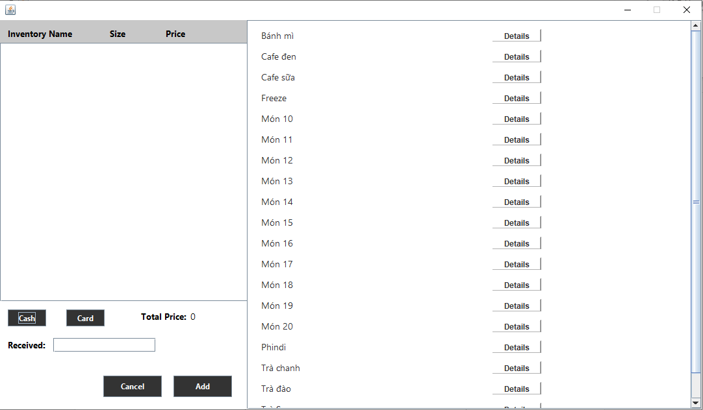

A Java application developed to help cafe owners manage employees, products, orders and revenue more effectively. This project was done as the final project for the module CSC13102 - Java Programming at HCMUS.

## Features

- Admin & Employee UI.
- Manage employee information.
- Manage revenue.
- Mange order.
- Statistics with chart for visualization.
- Authentication/Authorization.
- Searching.
- Timekeeping for employees (Checkin/checkout).
- Pay with cash (default) or via a payment system (emulated).
- SSL connection to payment system.

## Tech stack

- Java
- Java Swing for UI
- MySQL
- Hibernate ORM

## Contributions

Special thanks to these amazing people for their contributions to the project:

- [Nam Vu Hoai](https://github.com/namhoai1109)
- [Trung Thieu Vinh](https://github.com/tvtrungg)
- [Man Huynh Nguyen](https://github.com/nhman2002)
