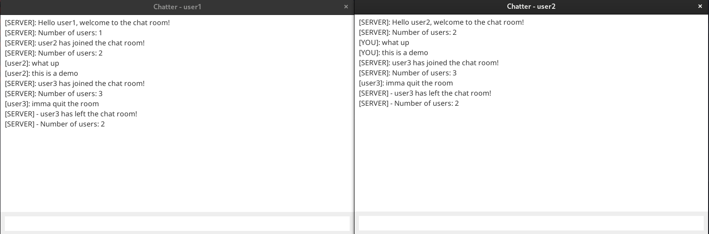

A simple multi-threaded chat application supporting concurrent connections written in Java. This project was done as part of the course work for the module CSC13102 - Java Programming at HCMUS.



## Features

- Multi-threaded server to handle multiple clients
- UI built with Java Swing
- Handle connection and disconnection of clients

## Quick Start

1. Run the server

```bash
cd server
java Server.java
```

2. Run the client

```bash
cd client
java Client.java // run multiple times to simulate multiple clients
```
