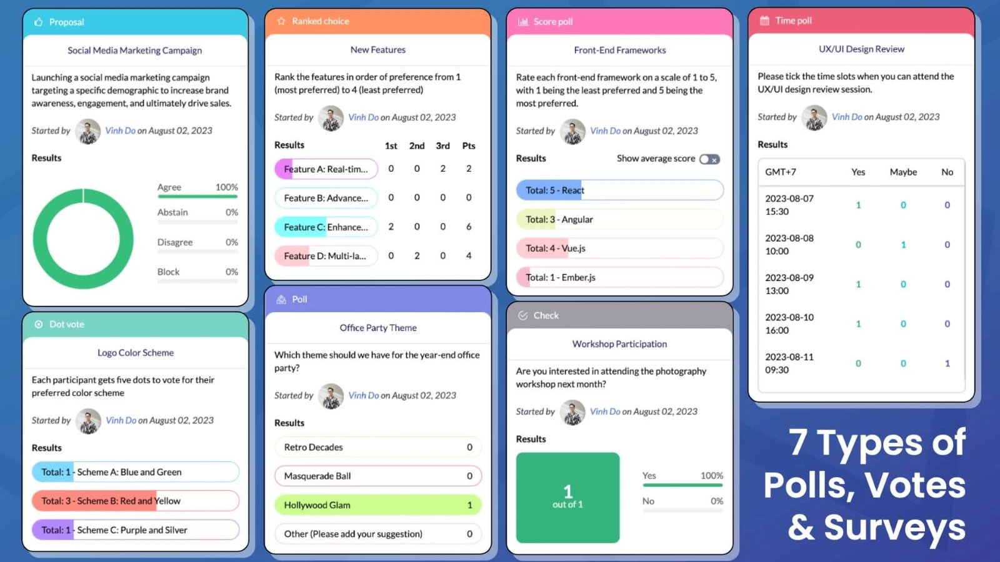

## Team+

Team+ is a Confluence app that allows you to create polls, votes, surveys and community network. It is a great tool for team building, decision making, feedback gathering and more. Team+ is available on the [Atlassian Marketplace](https://marketplace.atlassian.com/apps/1221853/polls-votes-surveys-community-network-for-confluence?hosting=cloud&tab=overview).

## Features

-  **Enterprise social networking SNS, community forums**: Social collaboration tool similar to Facebook and Twitter for organizations. Salesforce Chatter or Microsoft Yammer alternatives on the Confluence. Share ideas, questions & answers, surveys, etc.
- **Create, manage and communicate polls, votes**: Polls, votes and survey tool to guarantee consensus between team members. Support Proposal, Check, Poll, Dot Vote, Score Poll, Time Poll and Ranked Choice for team communication and decision making.
- **Insert poll, post as Confluence macro**: Show in Confluence page and allow participants to interact with polls, surveys.

## My contributions

This is the project that I'm working on for the internship at [DevSamurai Vietnam](https://devsamurai.vn/). I work both on the frontend and the backend of the app. My main responsibility includes:

- **Adding new features**: Add new features to the app based on the requirements from the product manager. Sometimes I like to roll out new features that I think would be useful for the app.
- **Optimizing the performance of the app**: Refactor and fix existing code to improve the performance of the app.
